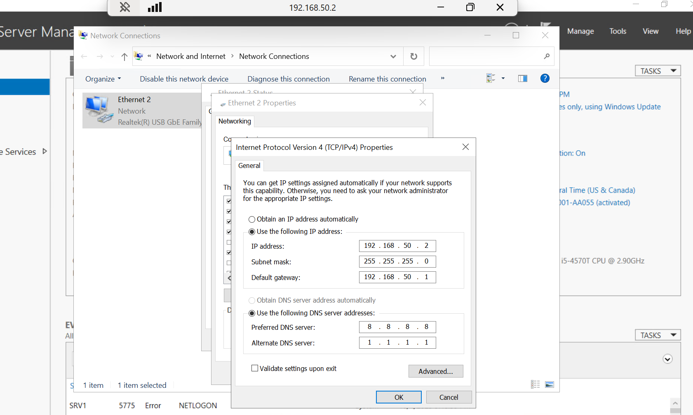
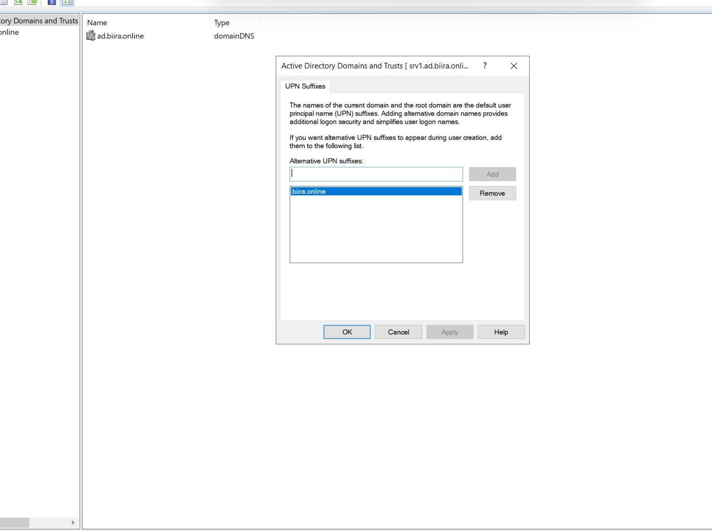

# Phase 1: Foundation - Active Directory & OKTA Tenant Setup

## Executive Summary

I established the foundational infrastructure for a hybrid identity management environment, implementing Active Directory Domain Services on Windows Server 2022 and provisioning an OKTA Integrator tenant for cloud identity services. The implementation includes split-brain DNS architecture, alternative UPN suffix configuration, and initial OKTA customization.

**Key Achievements:**
- Deployed Windows Server 2022 as primary domain controller (srv1)
- Established Active Directory domain: *ad.biira.online*
- Configured split-brain DNS architecture for hybrid identity
- Added alternative UPN suffix: biira.online for cloud SSO
- Provisioned and customized OKTA Integrator tenant
- Validated initial SSO functionality with test users

---

## Infrastructure Deployment

### Server Specifications

I deployed Windows Server 2022 on physical hardware to serve as the primary domain controller for the enterprise IAM lab.

**Hardware Configuration:**
- **Platform:** Physical server (repurposed desktop)
- **Server Name:** srv1
- **Operating System:** Windows Server 2022 Standard (Desktop Experience)
- **RAM:** 8GB
- **CPU:** 4 cores
- **Storage:** 222GB
- **Network:** Physical Ethernet adapter

### Network Configuration

I configured the server with a static IP address on a dedicated management VLAN to isolate domain controller traffic.

**Network Settings:**
```powershell
# Configure static IP address
New-NetIPAddress -InterfaceAlias "Ethernet0" `
                 -IPAddress 192.168.50.2 `
                 -PrefixLength 24 `
                 -DefaultGateway 192.168.50.1

# Set DNS servers (initially external, later points to itself)
Set-DnsClientServerAddress -InterfaceAlias "Ethernet0" `
                           -ServerAddresses 192.168.50.1,8.8.8.8
```

**Network Details:**
- **IP Address:** 192.168.50.2/24
- **VLAN:** 50 (Management)
- **Gateway:** 192.168.50.1
- **Initial DNS:** External resolvers (reconfigured post-AD installation)

**Rationale:** Static IP ensures consistent domain controller accessibility. VLAN segmentation follows enterprise network design principles for security and traffic isolation.


*Figure 1: Static IP configuration showing 192.168.50.2 address assignment on srv1. Network adapter properties display manual IP configuration with subnet mask 255.255.255.0 and default gateway 192.168.50.1, establishing the foundation for domain controller network accessibility.*

---

## Active Directory Domain Services Implementation

### AD DS Role Installation

I installed Active Directory Domain Services using PowerShell for consistent, repeatable deployment.

```powershell
# Install AD DS role with management tools
Install-WindowsFeature -Name AD-Domain-Services -IncludeManagementTools

# Verify installation
Get-WindowsFeature -Name AD-Domain-Services
```

**Installation Method:** PowerShell automation ensures documentation of the exact process and enables script-based replication for future domain controllers.

### Domain Controller Promotion

I promoted the server to domain controller, creating a new Active Directory forest.

```powershell
# Import AD deployment module
Import-Module ADDSDeployment

# Promote to domain controller - new forest
Install-ADDSForest `
    -DomainName "ad.biira.online" `
    -DomainNetbiosName "AD" `
    -ForestMode "WinThreshold" `
    -DomainMode "WinThreshold" `
    -InstallDns:$true `
    -SafeModeAdministratorPassword (ConvertTo-SecureString "Removed from Github" -AsPlainText -Force) `
    -Force:$true
```

**Domain Configuration:**
- **Forest Root Domain:** ad.biira.online
- **NetBIOS Name:** AD
- **Forest Functional Level:** Windows Server 2016 (WinThreshold)
- **Domain Functional Level:** Windows Server 2016 (WinThreshold)
- **DNS:** Automatically installed with AD DS
- **Global Catalog:** Yes (first DC in forest)

**Design Decision - Domain Naming:**
I chose `ad.biira.online` as the internal domain rather than using the public domain `biira.online` directly. This split-brain DNS approach is enterprise-standard, separating internal infrastructure (ad.biira.online) from public-facing identity (biira.online), which becomes the UPN suffix for user accounts.

### Post-Promotion DNS Configuration

After promotion, I reconfigured DNS to point to the server itself (loopback), making it self-sufficient for name resolution.

```powershell
# Update DNS to point to itself
Set-DnsClientServerAddress -InterfaceAlias "Ethernet0" `
                           -ServerAddresses 127.0.0.1,192.168.50.2

# Verify AD services
Get-Service -Name ADWS,DNS,Netlogon,NTDS | Select-Object Name,Status,StartType
```

**Critical Services Verified:**
- Active Directory Web Services (ADWS) - Running Automatic
- DNS Server - Running Automatic
- Netlogon - Running Automatic
- NT Directory Services (NTDS) - Running Automatic


---


## DNS Architecture Implementation

### Split-Brain DNS Design

I implemented a split-brain DNS architecture to separate internal domain infrastructure from user-facing cloud identity.

**Internal DNS Zone: ad.biira.online**
- **Zone Type:** Active Directory-Integrated
- **Purpose:** Internal AD domain, computer authentication, Kerberos
- **Scope:** Homelab network only (not internet-routable)
- **DNS Server:** srv1 (192.168.50.2)

**Public DNS Domain: biira.online**
- **DNS Provider:** Namecheap
- **Purpose:** Public domain, user UPN suffix, external services
- **Scope:** Internet-routable

**Why This Matters:**
Users authenticate with clean UPN: `username@biira.online` (matches public domain)
Internal computers use: `ad.biira.online` for Kerberos and domain services
OKTA sync uses: `@biira.online` UPN for professional SSO experience. This will also be the case for any other Identity Providers that it will be integrated with.

### DNS Records Configuration

**Forward Lookup Zone (ad.biira.online):**

Set DNS CLeitServerAddress as Ethernet 2

```powershell

Set-DnsClientServerAddress -InterfaceAlias "Ethernet 2"-ServerAddresses 192.168.50.2,8.8.8.8

Get-DnsClientServerAddress -InterfaceAlias "Ethernet
```

Critical SRV records automatically created by AD promotion:

```powershell
# Verify LDAP SRV records
nslookup -type=SRV _ldap._tcp.dc._msdcs.ad.biira.online

# Verify Kerberos SRV records
nslookup -type=SRV _kerberos._tcp.ad.biira.online

# Verify domain controller A record
nslookup srv1.ad.biira.online
```

**Reverse Lookup Zone (50.168.192.in-addr.arpa):**

```powershell
# Create reverse zone
Add-DnsServerPrimaryZone -NetworkID "192.168.50.0/24" `
                         -ReplicationScope "Forest"

# Add PTR record for DC
Add-DnsServerResourceRecordPtr -ZoneName "50.168.192.in-addr.arpa" `
                               -Name "2" `
                               -PtrDomainName "srv1.ad.biira.online"

# Verify reverse lookup
nslookup 192.168.50.2
# Returns: srv1.ad.biira.online
```

### DNS Forwarders

I configured external DNS forwarders to enable internet name resolution from the domain.

```powershell
# Add Google DNS as forwarders
Add-DnsServerForwarder -IPAddress 8.8.8.8
Add-DnsServerForwarder -IPAddress 8.8.4.4

# Test external resolution
nslookup google.com
nslookup biira.online
```

**Purpose:** Domain-joined computers can resolve both internal AD resources and external internet domains through the DC's DNS service.

---

## UPN Suffix Configuration (Critical for OKTA)

### The Two-Domain Strategy

I configured an alternative UPN suffix to enable clean, professional cloud SSO while maintaining internal domain security.

**Internal AD Domain:** ad.biira.online
- Used for: Computer accounts, Kerberos realm, AD infrastructure
- Visible to: Internal network only
- Example: `COMPUTER01.ad.biira.online`

**Public UPN Suffix:** biira.online
- Used for: User account logins, OKTA authentication, email
- Visible to: Users and cloud services
- Example: `john.smith@biira.online`

### Implementation

**Adding UPN Suffix via GUI:**
1. Opened Active Directory Domains and Trusts
2. Right-clicked root → Properties → UPN Suffixes tab
3. Added: `biira.online`
4. Applied and verified

**PowerShell Verification:**
```powershell
# Add UPN suffix to forest
Get-ADForest | Set-ADForest -UPNSuffixes @{Add="biira.online"}

# Verify UPN suffixes available
(Get-ADForest).UPNSuffixes
# Output: biira.online
```

**Location:** `assets/images/screenshots/phase-1/01-upn-suffix-config.png`


*Figure 2: Active Directory Domains and Trusts showing UPN Suffixes configuration. The alternative UPN suffix "biira.online" has been added to the forest, enabling users to authenticate with username@biira.online instead of username@ad.biira.online. This configuration is essential for clean OKTA SSO integration and professional user experience.*

**Why This Architecture:**
- Users never see internal domain structure (ad.biira.online)
- Login experience is professional: `username@biira.online`
- OKTA reads UPN directly, no transformation needed
- Matches public domain for brand consistency
- Standard enterprise pattern (Microsoft uses this with @microsoft.com vs internal domains)

---

## OKTA Tenant Provisioning & Configuration

### OKTA Integrator Tenant Setup

I provisioned an OKTA Integrator (formerly Developer) tenant for the cloud identity platform.

**Tenant Details:**
- **Tenant Type:** Integrator (free tier with full feature access)
- **Tenant URL:** `integrator-9057042-admin.okta.com`
- **Admin Console:** Full access to Universal Directory, SSO, MFA
- **User Capacity:** 10 active users (sufficient for lab environment)

**Location:** `assets/images/screenshots/phase-1/03-okta-dashboard.png`


*Figure 3: OKTA Admin Console dashboard showing operational status. The overview displays 4 active users (initial test accounts), 8 SSO applications configured, and OKTA service showing "Operational" status with no agents added yet (AD Agent installation pending Phase 3).*

### Custom Branding Implementation

I configured custom branding to align the OKTA tenant with the organization's public domain.

**Custom Domain Configuration:**
- **Primary Brand:** Biira
- **Custom Domain:** www.biira.online
- **OKTA Subdomain:** integrator-9057042.okta.com (default)

**Implementation Steps:**
1. Navigated to Customizations → Brands
2. Created new brand: "Biira"
3. Configured custom domain: `www.biira.online`
4. Uploaded brand logo (optional for lab)
5. Set as default brand for user-facing pages

**Location:** `assets/images/screenshots/phase-1/04-okta-brands.png`


*Figure 4: OKTA Brands configuration page showing two brands: "Biira" with custom domain www.biira.online (organization brand) and the default OKTA subdomain integrator-9057042.okta.com. Custom branding ensures users see the organization's domain rather than generic OKTA URLs, providing professional SSO experience.*

**Why Custom Branding Matters:**
- Users see `www.biira.online` instead of `integrator-9057042.okta.com`
- Professional appearance for SSO login pages
- Brand consistency across authentication flows
- Prepares for production deployment patterns

### Initial User Provisioning

I created initial test users in OKTA to validate SSO functionality before AD integration.

**Test Users Created:**
- Noble Antwi (noble.antwi@biira.online) - Admin account
- Enam Vondee (enam.vondee@biira.online) - Test user
- Noble Worlanyo (nobleworlda@biira.online) - Test user

**Purpose:** Validate OKTA tenant functionality, SSO flows, and MFA policies before implementing AD Agent synchronization.

**Location:** `assets/images/screenshots/phase-1/05-okta-users.png`


*Figure 5: OKTA Directory showing initial user accounts. The People directory displays 4 active users with email addresses using @biira.online and other domains. These test accounts validate OKTA tenant functionality and SSO configuration before AD Agent integration in Phase 3.*

---

## Domain Validation & Health Checks

### DCDIAG Validation

I ran comprehensive domain controller diagnostics to verify AD health.

```powershell
# Full domain controller diagnostic
dcdiag /v

# Specific critical tests
dcdiag /test:DNS
dcdiag /test:NetLogons
dcdiag /test:Replications
dcdiag /test:Services
```

**All tests passed successfully:**
- DNS configuration and zone health
- NetLogon service functionality
- Replication readiness (single DC environment)
- Critical AD services running

### DNS Validation

```powershell
# Test internal DNS resolution
nslookup ad.biira.online
nslookup srv1.ad.biira.online

# Test SRV records (critical for AD)
nslookup -type=SRV _ldap._tcp.ad.biira.online

# Test reverse lookup
nslookup 192.168.50.2
# Returns: srv1.ad.biira.online (correct)
```

### Active Directory Validation

```powershell
# Verify domain information
Get-ADDomain

# Verify forest configuration
Get-ADForest

# Check domain controllers
Get-ADDomainController -Filter *

# Confirm UPN suffixes
(Get-ADForest).UPNSuffixes
# Output: biira.online
```

**All validations successful** - domain controller fully operational and ready for user/group provisioning.

---

## Public DNS Configuration

### Namecheap Domain Management

I configured the public domain (biira.online) at Namecheap with basic DNS records.

**Current DNS Records:**
- **A Record (@):** Points to web server or placeholder
- **CNAME (www):** Redirects www.biira.online to root domain
- **TXT Records:** Domain verification for services

**Location:** `assets/images/screenshots/phase-1/02-namecheap-domain.png`


*Figure 6: Namecheap domain management dashboard for biira.online. The domain status shows "Active" with auto-renew enabled through September 2026. Domain uses Namecheap BasicDNS for public DNS hosting, completely separate from internal AD DNS (ad.biira.online), demonstrating proper split-brain DNS architecture.*

**Future OKTA Custom Domain (Phase 3+):**
When configuring OKTA custom domain, additional DNS records will be required:
- CNAME: `okta.biira.online` → OKTA tenant
- TXT: Domain verification code from OKTA

**Current State:** Public DNS functional, ready for OKTA custom domain configuration in future phase.

---

## Architecture Summary

### Hybrid Identity Foundation

The implemented architecture establishes the foundation for hybrid identity management:

```
┌─────────────────────────────────────────────────┐
│              CLOUD (OKTA)                       │
│                                                 │
│  OKTA Tenant: integrator-9057042.okta.com      │
│  Custom Brand: www.biira.online                 │
│  Test Users: 4 active                           │
│  Status: Ready for AD Agent                     │
└─────────────────────┬───────────────────────────┘
                      │
                      │ (Phase 3: AD Agent Sync)
                      │
┌─────────────────────▼───────────────────────────┐
│         ON-PREMISES (Active Directory)          │
│                                                 │
│  Domain: ad.biira.online                        │
│  Domain Controller: srv1 (192.168.50.2)         │
│  UPN Suffix: biira.online                       │
│  DNS: Split-brain configured                    │
│  Status: Operational, validated                 │
└─────────────────────────────────────────────────┘
```

### Integration Readiness Checklist

**Active Directory:**
- ✅ Domain controller deployed and operational
- ✅ DNS configured with forward/reverse zones
- ✅ Alternative UPN suffix added (biira.online)
- ✅ Domain health validated (DCDIAG passed)
- ✅ Services running (ADWS, DNS, Netlogon, NTDS)

**OKTA:**
- ✅ Integrator tenant provisioned
- ✅ Custom branding configured (www.biira.online)
- ✅ Initial test users created
- ✅ Admin console accessible

**Network:**
- ✅ Static IP configured (192.168.50.2)
- ✅ VLAN segmentation (Management VLAN 50)
- ✅ DNS forwarders configured
- ✅ Split-brain DNS operational

**Public Infrastructure:**
- ✅ Domain registered (biira.online via Namecheap)
- ✅ Public DNS configured
- ✅ Ready for OKTA custom domain (future)

---

## Security Considerations

### Domain Security Baseline

**Implemented:**
- Static IP assignment (prevents DHCP security issues)
- Separate management VLAN (network isolation)
- DNS security (internal zone protected, forwarders configured)
- DSRM password secured (disaster recovery capability)

**Pending (Phase 2+):**
- Group Policy security baseline
- Password complexity policies
- Audit logging configuration
- Tiered administrative model implementation

### OKTA Security

**Initial Configuration:**
- Admin account with strong credentials
- Test users for validation only
- MFA capability available (not yet enforced)
- Custom branding prevents phishing (users expect biira.online)

**Future Security (Phase 3+):**
- MFA enforcement for all users
- Conditional Access policies
- AD group-based provisioning
- Service account with least privilege for AD Agent

---

## Lessons Learned

### Successful Approaches

**1. Split-Brain DNS from Day 1:**
Implementing separate internal (ad.biira.online) and public (biira.online) domains early prevented the need for complex renaming or migration later. This enterprise-standard approach provides clean user experience and security benefits.

**2. PowerShell Automation:**
Using PowerShell for AD installation and configuration created documentation of the exact process, enabling repeatable deployments and troubleshooting.

**3. Validation at Each Step:**
Running DCDIAG, DNS verification, and service checks after each major change caught issues early and confirmed successful implementation.

### Challenges Addressed

**Challenge:** Understanding UPN suffix vs domain name
**Solution:** Researched Microsoft documentation on hybrid identity, learned that UPN suffix can differ from AD domain for user experience benefits

**Challenge:** DNS resolution for both internal and external resources
**Solution:** Configured DNS forwarders to Google DNS (8.8.8.8, 8.8.4.4) enabling both internal AD lookups and external internet resolution

**Challenge:** OKTA tenant setup without prior OKTA experience
**Solution:** Utilized OKTA documentation and community resources to configure Integrator tenant and custom branding

---

## Next Steps: Phase 2 - Active Directory Structure

With the foundation complete, Phase 2 focuses on organizing Active Directory for enterprise use:

**1. OU Structure Design**
- Create hierarchical OU structure (Users, Groups, Computers, Admin)
- Implement tiered administrative model (Tier 0/1/2)
- Organize users by department

**2. Security Group Creation**
- OKTA integration groups (SG-OKTA-AllUsers, SG-OKTA-Admins, etc.)
- Department access groups
- Role-based access control framework

**3. User Provisioning**
- Bulk user creation via PowerShell
- Proper UPN configuration (@biira.online)
- Group membership assignment

**4. Service Account Creation**
- OKTA AD Agent service account (svc-okta-agent)
- Appropriate permissions and security settings

---

## Conclusion

I successfully established the foundational infrastructure for a hybrid identity management environment. The implementation demonstrates:

- Enterprise-grade Active Directory deployment on Windows Server 2022
- Split-brain DNS architecture for internal/external identity separation
- Alternative UPN suffix configuration for clean cloud SSO experience
- OKTA cloud tenant provisioning with custom branding
- Comprehensive validation ensuring system health and readiness

**Key Architectural Decisions:**
1. **ad.biira.online** as internal AD domain (security/infrastructure)
2. **biira.online** as UPN suffix (user-facing/cloud identity)
3. Split-brain DNS (internal AD + public domain separation)
4. VLAN segmentation (management traffic isolation)
5. PowerShell automation (repeatability and documentation)

The environment is now ready for Phase 2: Active Directory organizational structure implementation, including OU design, security groups, and user provisioning.

---

**Implementation Author:** Noble W. Antwi  
**Implementation Date:** October 2025  
**Phase Status:**  Complete  
**Next Phase:** Active Directory Organizational Structure (Phase 2)