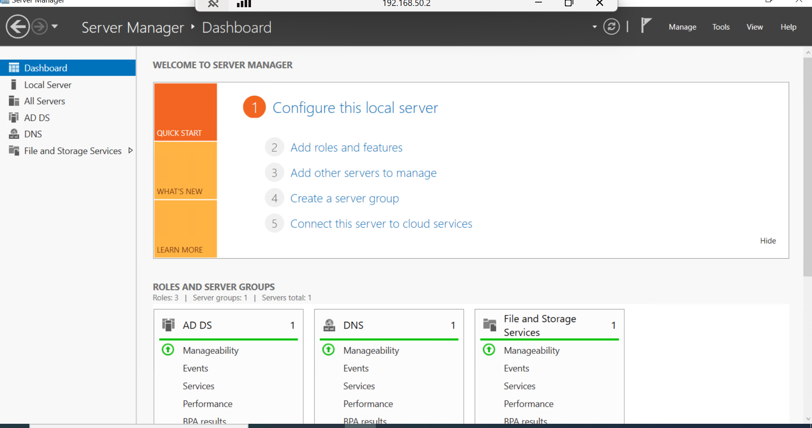
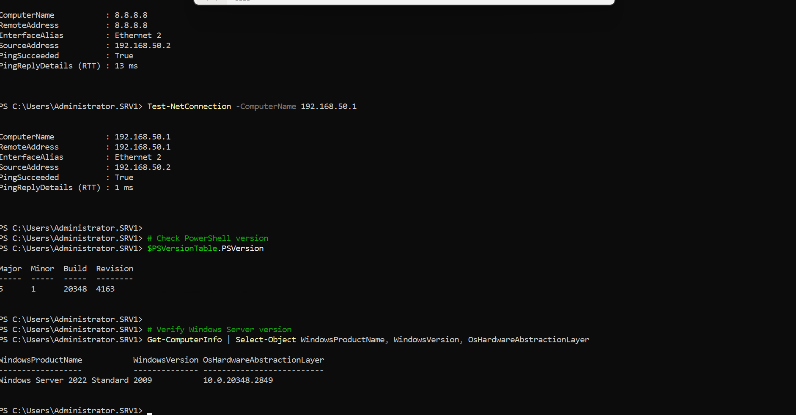

# Phase 1: Windows Server 2022 Deployment

## Overview
This document details the initial deployment of srv1, the primary domain controller for the Enterprise IAM Lab.

---

## Pre-Deployment Planning

### Environment Details
- **Lab Type:** Home Lab (Physical Hardware)
- **Hardware:** Repurposed Desktop Computer
- **Network:** 192.168.50.0/24 (VLAN 50 - Management)
- **Purpose:** Active Directory Domain Controller

### Server Specifications
- **Server Name:** srv1
- **OS:** Windows Server 2022 Standard (Desktop Experience)
- **RAM:** 8GB
- **CPU Cores:** 4 cores
- **Disk Space:** 60GB
- **Network:** Physical Ethernet adapter

---

## Installation Steps

### 1. Prepare Installation Media
- Downloaded Windows Server 2022 ISO from Microsoft
- Created bootable USB drive using Rufus or Windows Media Creation Tool
- Booted physical machine from USB

### 2. Windows Server 2022 Installation
- **Selected:** Windows Server 2022 Standard (Desktop Experience)
- **Partition:** Single partition, full disk
- **Installation Type:** Custom (clean install)
- **Administrator Password:** Set securely (stored in secure vault - not documented here)



 Server Manager showing srv1
### 3. Initial Server Configuration

#### Computer Name
```powershell
# Rename computer to srv1
Rename-Computer -NewName "srv1" -Restart
```

#### Network Configuration

**Static IP Assignment:**
```powershell
# Get network adapter name
Get-NetAdapter

# Configure static IP
New-NetIPAddress -InterfaceAlias "Ethernet" `
                 -IPAddress 192.168.50.2 `
                 -PrefixLength 24 `
                 -DefaultGateway 192.168.50.1

# Set DNS (initially to gateway, will change after AD installation)
Set-DnsClientServerAddress -InterfaceAlias "Ethernet" `
                           -ServerAddresses 192.168.50.1,8.8.8.8
```

Network adapter properties showing 


**Network Details:**
- **IP Address:** 192.168.50.2
- **Subnet Mask:** 255.255.255.0 (/24)
- **Default Gateway:** 192.168.50.1
- **DNS Servers:** 192.168.50.1, 8.8.8.8 (will change to 127.0.0.1 after AD installation)

> **Note:** The network adapter name may vary. Use `Get-NetAdapter` to confirm the correct interface name on your system.

#### Windows Updates
```powershell
# Install Windows updates via Settings or PowerShell
Install-Module PSWindowsUpdate -Force
Get-WindowsUpdate
Install-WindowsUpdate -AcceptAll -AutoReboot
```

**Manual Method:**
1. Open Settings → Windows Update
2. Check for updates
3. Install all critical and security updates
4. Restart as needed

#### Time Zone Configuration
```powershell
# Set to Central Standard Time (adjust to your timezone)
Set-TimeZone -Name "Central Standard Time"

# Verify
Get-TimeZone
```

### 4. Final Configuration

#### Server Manager Verification
- Opened Server Manager to verify all services running correctly
- Confirmed no errors or warnings on dashboard
- Server ready for role installation

---

## Validation Checklist

Before proceeding to AD installation:

- [x] Server name: srv1
- [x] Static IP: 192.168.50.2 configured
- [x] Network connectivity: Can ping gateway and internet
- [x] Windows updates: All critical updates installed
- [x] Server Manager: Opens without errors
- [x] PowerShell: Version 5.1 or higher available

### Validation Commands
```powershell
# Check computer name
hostname

# Check IP configuration
Get-NetIPAddress | Where-Object {$_.InterfaceAlias -like "Ethernet*"}

# Test network connectivity
Test-NetConnection -ComputerName 8.8.8.8
Test-NetConnection -ComputerName 192.168.50.1

# Check PowerShell version
$PSVersionTable.PSVersion

# Verify Windows Server version
Get-ComputerInfo | Select-Object WindowsProductName, WindowsVersion, OsHardwareAbstractionLayer
```

**Expected Output:**
```
ComputerName: srv1
IPAddress: 192.168.50.2
Gateway: Reachable
PowerShell: 5.1 or higher
```


PowerShell output of validation 
---


---

## Troubleshooting

### Issue: Network adapter not found
**Solution:** Run `Get-NetAdapter` to identify the correct adapter name. It may be "Ethernet", "Ethernet0", or another name depending on your hardware.

### Issue: Cannot set static IP
**Solution:** Ensure you're running PowerShell as Administrator and that the adapter is enabled.

### Issue: Windows updates failing
**Solution:** Check internet connectivity. Ensure DNS is properly configured. Try manual update via Settings.

---
`

---

## Summary

**What We Accomplished:**
- Installed Windows Server 2022 on physical hardware
- Configured srv1 with static IP (192.168.50.2)
- Applied all Windows updates
- Prepared server for Active Directory installation

**Environment Ready For:**
- Active Directory Domain Services installation
- Domain Controller promotion to ad.biira.online

---
