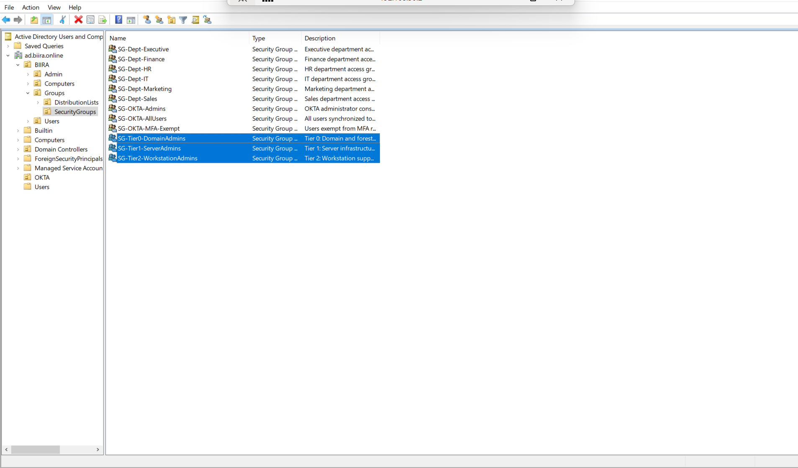
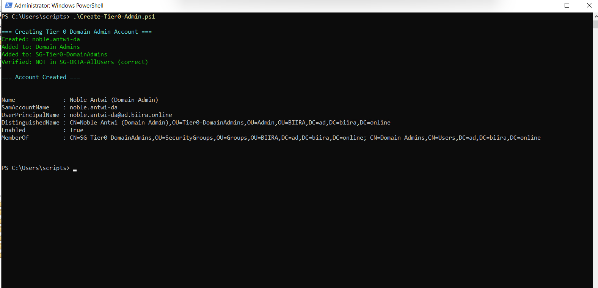
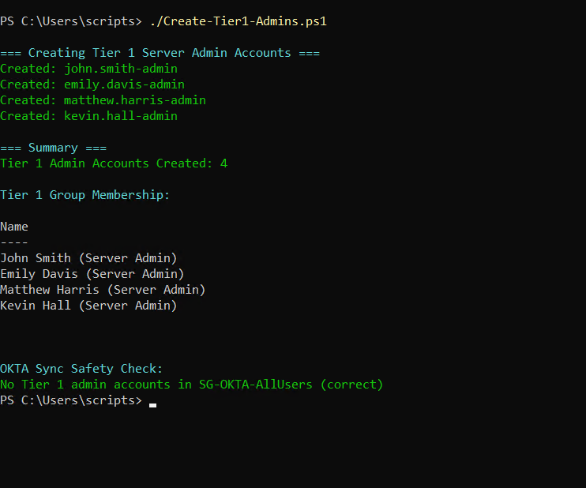
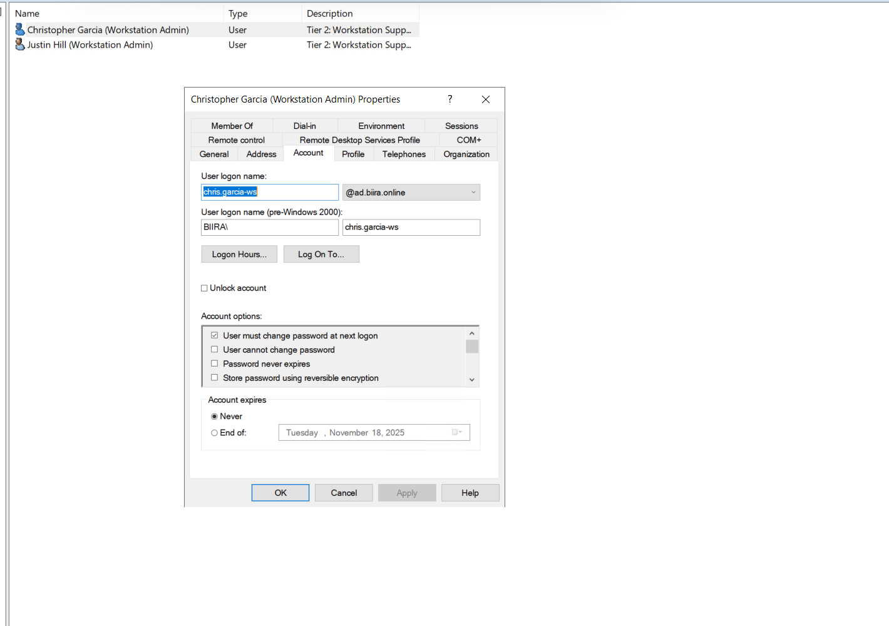
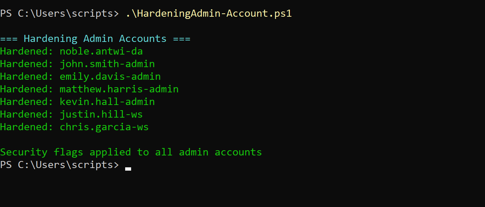
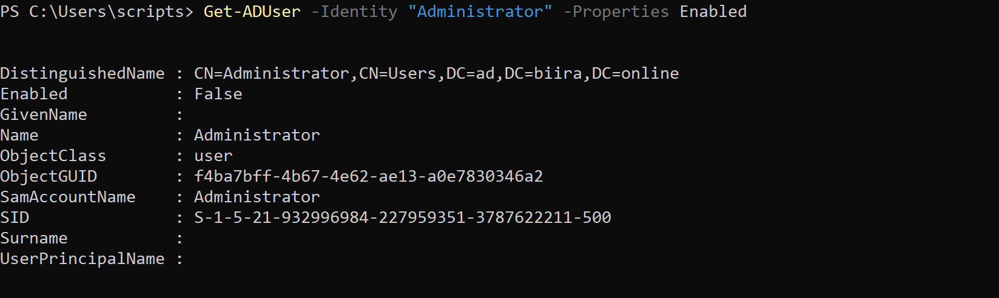

# Phase 2: Administrative Account Implementation - Tiered Security Model

## Executive Summary

Following the completion of employee user provisioning, I implemented Microsoft's Tiered Administrative Model to establish privileged account separation. This implementation created 7 administrative accounts across three security tiers, applied advanced security hardening, and deactivated the built-in Administrator account in accordance with enterprise security best practices.

**Key Achievements:**
- Implemented three-tier administrative structure (Tier 0/1/2)
- Created 7 dedicated administrative accounts with enhanced security controls
- Established dual-account pattern for IT staff (regular + admin accounts)
- Applied Kerberos security hardening to prevent delegation and AS-REP roasting attacks
- Disabled built-in Administrator account to eliminate well-known attack target
- Verified complete isolation from OKTA cloud synchronization

---

## Administrative Security Architecture Overview

### Design Rationale

Enterprise environments require separation between regular user accounts and privileged accounts. The dual-account pattern prevents credential theft attacks where compromised daily-use accounts cannot be leveraged for infrastructure access.

**Problem with Single Account:**
```
User with admin rights using one account:
├── Uses account for: Email, web browsing, SSO to cloud apps
├── Uses same account for: Domain administration, server management
└── Risk: Phishing email → compromised credentials → full infrastructure access 
```

**Solution: Dual Account Pattern:**
```
Regular Account (noble.antwi@biira.online):
├── Uses for: Email, collaboration, SaaS applications
├── Privileges: Standard user
├── Syncs to: OKTA cloud
└── Risk: Isolated - compromise doesn't expose admin credentials ✓

Admin Account (noble.antwi-da@ad.biira.online):
├── Uses for: Domain administration ONLY
├── Privileges: Domain Admin
├── Syncs to: Nowhere (stays local)
└── Risk: Minimal - only used from secure admin workstation ✓
```

### Microsoft Tiered Administrative Model

The implementation follows Microsoft's Enhanced Security Admin Environment (ESAE) framework, which organizes administrative access into three tiers based on asset criticality.

**Key Security Principle:**
- Lower tiers CANNOT authenticate to higher tiers
- Tier 2 admin compromise cannot escalate to Tier 1 or Tier 0
- Each tier uses separate credentials with distinct authentication boundaries
- Prevents lateral movement and privilege escalation attacks

---

## Implementation Phase 1: Admin Security Groups

### Overview

I created three security groups to organize administrative accounts by privilege level, implementing the foundation for role-based access control and tiered administration.

### Script: Create-AdminGroups.ps1

**Script saved at:** `scripts/active-directory/Create-AdminGroups.ps1`

The script creates three security groups in the SecurityGroups OU:
- SG-Tier0-DomainAdmins: Domain and forest administrators
- SG-Tier1-ServerAdmins: Server infrastructure administrators
- SG-Tier2-WorkstationAdmins: Workstation support and help desk

### Groups Created

| Group Name | Purpose | Privilege Level |
|------------|---------|-----------------|
| SG-Tier0-DomainAdmins | Domain and forest administration | Highest - full domain control |
| SG-Tier1-ServerAdmins | Server infrastructure management | Medium - server admin rights |
| SG-Tier2-WorkstationAdmins | End-user support and workstation management | Lower - password reset, desktop support |

### Security Architecture Purpose

**Tier 0 (Control Plane):**
- Controls: Domain controllers, AD schema, forest trusts
- Cannot authenticate to: Lower tier assets
- Example tasks: Promote domain controllers, modify forest configuration

**Tier 1 (Application Plane):**
- Controls: Member servers, applications, databases
- Cannot authenticate to: Domain controllers
- Example tasks: Install IIS, manage SQL Server, deploy applications

**Tier 2 (Workstation Plane):**
- Controls: User workstations, printers, user accounts
- Cannot authenticate to: Servers or domain controllers
- Example tasks: Reset passwords, unlock accounts, install workstation software

### OKTA Exclusion Strategy

```
Employee Security Groups:
└── SG-OKTA-AllUsers, SG-Dept-[Department]
    └── Purpose: Enable cloud SSO, sync to OKTA

Admin Security Groups:
└── SG-Tier[0/1/2]-[Type]Admins
    └── Purpose: Privilege management, EXCLUDED from OKTA sync
```

This separation ensures privileged accounts never touch cloud services, reducing attack surface and maintaining on-premises security control.

### Script Execution

**Command:**
```powershell
cd C:\enterprise-iam-lab\scripts\active-directory
.\Create-AdminGroups.ps1
```

**Expected Output:**
```
=== Admin Groups Created ===
Name                          Description
----                          -----------
SG-Tier0-DomainAdmins        Tier 0: Domain and forest administrators
SG-Tier1-ServerAdmins        Tier 1: Server infrastructure administrators
SG-Tier2-WorkstationAdmins   Tier 2: Workstation support and help desk
```

**Verification:**

```powershell
# Verify groups created in SecurityGroups OU
Get-ADGroup -Filter "Name -like 'SG-Tier*'" -SearchBase "OU=SecurityGroups,OU=Groups,OU=BIIRA,DC=ad,DC=biira,DC=online"
```




*Figure 1: SecurityGroups OU showing all 12 security groups - 9 for employees and 3 new admin tier groups.*

---

## Implementation Phase 2: Tier 0 Domain Administrator Account

### Overview

I created a dedicated Tier 0 domain administrator account (**noble.antwi-da**) as a replacement for the built-in Administrator account, following enterprise security best practices.

### Why Named Accounts vs Built-in Administrator

**Built-in Administrator Limitations:**
- Well-known SID: Always ends in -500 (predictable target)
- Cannot be deleted: Windows prevents deletion
- No personal attribution: Logs show generic "Administrator"
- Always targeted first: Known to attackers
- Shared account risk: Multiple people might use same credentials

**Named Account Benefits:**
- Unique SID: Not predictable
- Personal attribution: Logs show "noble.antwi-da" (clear responsibility)
- Individual credentials: Each person has their own admin account
- Can be disabled/deleted: Easy remediation if compromised
- Less obvious target: Attackers must discover account names

### Script: Create-Tier0-Admin.ps1

**Script saved at:** `scripts/active-directory/Create-Tier0-Admin.ps1`

The script creates the Tier 0 domain administrator account with proper group memberships and security settings.

### Account Configuration

| Attribute | Value | Rationale |
|-----------|-------|-----------|
| Username | noble.antwi-da | Named account with -da suffix for Domain Admin |
| UPN | noble.antwi-da@ad.biira.online | Internal domain suffix (not public) |
| Location | OU=Tier0-DomainAdmins,OU=Admin | Isolated from regular users |
| Member Of | Domain Admins, SG-Tier0-DomainAdmins | Full control + tier categorization |
| OKTA Sync | NO | Excluded from cloud synchronization |

### Dual Account Pattern for Noble Antwi

```
Regular Account:
├── Username: noble.antwi
├── UPN: noble.antwi@biira.online
├── Location: OU=IT,OU=Employees
├── Purpose: Daily work, email, SSO
├── OKTA Sync: YES
└── Privileges: Standard user

Admin Account:
├── Username: noble.antwi-da
├── UPN: noble.antwi-da@ad.biira.online
├── Location: OU=Tier0-DomainAdmins,OU=Admin
├── Purpose: Domain administration only
├── OKTA Sync: NO
└── Privileges: Domain Admin
```

### Security Benefits

**Credential Isolation:**
- Compromise of regular account doesn't expose admin credentials
- Admin account never used for email or web browsing
- Reduces phishing attack surface

**Audit Trail:**
- Clear attribution: "noble.antwi-da performed X action"
- Separate logs for regular vs administrative actions
- Compliance requirement for privileged access

**Lateral Movement Prevention:**
- Admin credentials not cached on regular workstations
- Attacker cannot pivot from compromised user workstation
- Follows zero-trust principle


*Figure 2: PowerShell output showing Tier 0 account creation with verification that it's NOT in SG-OKTA-AllUsers.*

---

## Implementation Phase 3: Tier 1 Server Administrator Accounts

### Overview

I created four Tier 1 server administrator accounts for senior IT staff who manage infrastructure and member servers without requiring domain-level control.

### Script: Create-Tier1-Admins.ps1

**Script saved at:** `scripts/active-directory/Create-Tier1-Admins.ps1`

The script creates admin accounts for IT staff who need server management capabilities.

### Accounts Created

| Admin Account | Regular Account | Role | Responsibility |
|---------------|-----------------|------|----------------|
| john.smith-admin | john.smith | IT Manager | Server infrastructure, applications |
| emily.davis-admin | emily.davis | Network Engineer | Network devices, server connectivity |
| matthew.harris-admin | matthew.harris | DevOps Engineer | CI/CD servers, containerization |
| kevin.hall-admin | kevin.hall | Systems Engineer | Windows/Linux servers, services |

### Tier 1 Privilege Scope

**CAN DO:**
- Install and configure member servers
- Manage IIS, SQL Server, application servers
- Create service accounts in ServiceAccounts OU
- Deploy applications and updates
- Configure server-level permissions
- Backup and restore server data

**CANNOT DO:**
- Modify domain controllers
- Change AD schema or forest configuration
- Manage Domain Admins group
- Create forest trusts
- Access Tier 0 infrastructure

### Naming Convention

- Format: `firstname.lastname-admin`
- Suffix: `-admin` indicates server administrator
- UPN: `@ad.biira.online` (internal domain)
- Distinguishes from regular accounts and Tier 2 accounts

### Dual Account Pattern Example

**Emily Davis:**
```
Regular Account:
├── emily.davis@biira.online
├── OU=IT,OU=Employees
├── Groups: SG-OKTA-AllUsers, SG-Dept-IT
├── Syncs to OKTA: YES
└── Use: Email, Teams, daily work

Admin Account:
├── emily.davis-admin@ad.biira.online
├── OU=Tier1-ServerAdmins,OU=Admin
├── Groups: SG-Tier1-ServerAdmins
├── Syncs to OKTA: NO
└── Use: Server management only
```


*Figure 3: PowerShell output showing 4 Tier 1 accounts created with OKTA safety check passed.*

---

## Implementation Phase 4: Tier 2 Workstation Administrator Accounts

### Overview

I created two Tier 2 workstation administrator accounts for help desk and desktop support staff who assist end users without needing server or domain access.

### Script: Create-Tier2-Admins.ps1

**Script saved at:** `scripts/active-directory/Create-Tier2-Admins.ps1`

### Accounts Created

| Admin Account | Regular Account | Role | Responsibility |
|---------------|-----------------|------|----------------|
| chris.garcia-ws | christopher.garcia | Security Analyst | Workstation investigations, support |
| justin.hill-ws | justin.hill | Cloud Architect | Desktop support, software installation |

### Technical Note: SAM Account Name Limit

During creation, I encountered Active Directory's 20-character limit for SAM account names:

```
Attempted: christopher.garcia-ws (21 characters)  FAILED
Resolution: chris.garcia-ws (16 characters)  SUCCESS
```

**Active Directory Constraint:** SAM account name (sAMAccountName) maximum is 20 characters - a hard schema limit for backwards compatibility.

### Tier 2 Privilege Scope

**CAN DO:**
- Reset user passwords
- Unlock user accounts
- Install software on workstations
- Join computers to domain
- Troubleshoot user login issues
- Manage printers and local resources
- Modify non-sensitive user properties

**CANNOT DO:**
- Manage servers or applications
- Access member servers
- Modify domain configuration
- Create/delete user accounts
- Manage security groups

### Naming Convention

- Format: `firstname.lastname-ws`
- Suffix: `-ws` indicates workstation support
- Distinguishes from Tier 1 `-admin` accounts
- UPN: `@ad.biira.online`

### Why Tier 2?

Help desk staff need limited administrative rights for user support without exposing infrastructure. Tier 2 provides password reset and workstation management without server or domain access.

**Security Benefit:** If Tier 2 account compromised, attacker cannot pivot to servers or domain controllers.


*Figure 4: chris.garcia-ws account properties showing proper configuration.*

---

## Implementation Phase 5: Administrative Account Hardening

### Overview

After creating all administrative accounts, I applied enhanced security controls following Microsoft security baselines for privileged accounts. These controls protect against advanced Active Directory attacks that specifically target administrative credentials.

### Script: Harden-AdminAccounts.ps1

**Script saved at:** `scripts/active-directory/HardeningAdmin-Account.ps1`

The script applies two critical security flags to all administrative accounts across all three tiers.

### Security Controls Applied

#### 1. Account Not Delegated (AccountNotDelegated = True)

**Purpose:** Prevents Kerberos delegation attacks where compromised services impersonate administrative accounts.

**Attack Scenario Without Protection:**
```
Step 1: Administrator logs into compromised web server
Step 2: Web server receives admin's Kerberos ticket
Step 3: Attacker controls web server configuration
Step 4: Web server delegates admin's identity to access domain controller
Step 5: Attacker gains domain admin access without knowing password 
```

**With AccountNotDelegated = True:**
```
Step 1: Administrator logs into web server
Step 2: Web server receives admin's Kerberos ticket (marked "cannot be delegated")
Step 3: Attacker attempts to delegate admin identity
Step 4: Active Directory rejects: "Account is sensitive and cannot be delegated"
Step 5: Attack blocked 
```

#### 2. Require Kerberos Pre-Authentication (DoesNotRequirePreAuth = False)

**Purpose:** Prevents AS-REP Roasting attacks where attackers extract password hashes for offline cracking.

**Attack Scenario Without Pre-Authentication:**
```
Step 1: Attacker queries: "Request Kerberos ticket for noble.antwi-da"
Step 2: AD responds with encrypted ticket (no password verification)
Step 3: Attacker takes encrypted ticket offline
Step 4: Runs password cracker (unlimited time, no account lockout)
Step 5: Cracks weak password, gains domain admin access 
```

**With Pre-Authentication Required:**
```
Step 1: Attacker queries: "Request Kerberos ticket for noble.antwi-da"
Step 2: AD responds: "Prove you know the password first"
Step 3: Attacker cannot provide correct password
Step 4: No ticket issued - cannot obtain data for offline cracking 
```

### Why This Matters

Standard user accounts can tolerate some security risk because they have limited privileges. Administrative accounts require defense-in-depth:

```
Regular User Account Compromise:
└── Attacker gains: User's files, email, some applications
    └── Impact: Limited (single user)

Admin Account Compromise:
└── Attacker gains: Domain control, all data, infrastructure access
    └── Impact: Complete domain compromise, data breach, ransomware
```

### Accounts Hardened

| Tier | Accounts | Controls Applied  |
|------|----------|-------------------- |
| Tier 0 | noble.antwi-da (1) | AccountNotDelegated + Require Pre-Auth |
| Tier 1 | john.smith-admin, emily.davis-admin, matthew.harris-admin, kevin.hall-admin (4) | AccountNotDelegated + Require Pre-Auth |
| Tier 2 | chris.garcia-ws, justin.hill-ws (2) | AccountNotDelegated + Require Pre-Auth |
| **Total** | **7 admin accounts** | **All hardened** |

### Compliance Requirements

These hardening controls are required by:
- **NIST 800-53 (IA-2):** Enhanced authentication for privileged accounts
- **PCI-DSS 8.2.1:** Additional authentication for administrative access
- **CIS Benchmark:** Privileged account security controls
- **Microsoft Security Baselines:** Recommended for all admin accounts


*Figure 5: PowerShell output showing successful application of security hardening to all 7 administrative accounts.*

---

## Built-in Administrator Account Deactivation

### Overview

Following enterprise security best practices, I disabled the built-in Administrator account after creating the named Tier 0 replacement (noble.antwi-da). This eliminates a well-known attack target while maintaining emergency administrative access through the named account.

### Action Taken

```powershell
# Disable built-in Administrator account
Disable-ADAccount -Identity "Administrator"

# Verify disabled status
Get-ADUser -Identity "Administrator" -Properties Enabled
```

**Result:**
```
Name          : Administrator
Enabled       : False
DistinguishedName : CN=Administrator,CN=Users,DC=ad,DC=biira,DC=online
```

### Why Disable vs Harden?

| Approach | Security Benefit | Risk |
|----------|------------------|------|
| Harden | Adds protection layers | Well-known SID (-500) still targetable |
| **Disable** | **Eliminates target entirely**  | Can be re-enabled if needed |

### Security Rationale

**Built-in Administrator account has inherent vulnerabilities:**

1. **Well-Known SID:** Always ends in -500 (predictable target)
2. **Cannot Be Deleted:** Windows prevents deletion of built-in accounts
3. **No Personal Attribution:** Logs show generic "Administrator"
4. **Always Targeted First:** Attackers always attempt Administrator
5. **Shared Account Risk:** Multiple people might use same credentials

### Enterprise Standard Practice

Most Fortune 500 companies disable built-in Administrator:

```
Microsoft's Recommendation:
├── Disable: Built-in Administrator
├── Create: Named Tier 0 accounts (firstname.lastname-da)
├── Use: Named accounts for all admin tasks
└── Emergency: Can be re-enabled from Directory Services Restore Mode
```

### Emergency Access Plan

If noble.antwi-da becomes inaccessible:

```
Recovery Procedure:
├── Step 1: Reboot domain controller
├── Step 2: Enter Directory Services Restore Mode (DSRM)
├── Step 3: Use DSRM password to boot into recovery
├── Step 4: Re-enable built-in Administrator
├── Step 5: Reset password if needed
└── Step 6: Investigate why named account failed
```

### Compliance Requirements

Many security frameworks require disabling well-known default accounts:
- **PCI-DSS 8.2.1:** Remove/disable default accounts
- **CIS Benchmark:** Disable Administrator account
- **NIST 800-53 IA-2:** Use individual accounts for privileged access
- **SOC 2:** Unique identifiers for all privileged accounts


*Figure 6: Built-in Administrator account properties showing "Account is disabled" checkbox checked.*

---

## Administrative Account Summary

### Final Environment State

**Total Accounts in Active Directory: 35**

```
Regular Employee Accounts: 27
├── Location: OU=Employees (departmental sub-OUs)
├── UPN Suffix: @biira.online (public domain)
├── OKTA Sync: YES (members of SG-OKTA-AllUsers)
└── Purpose: Daily work, SSO to cloud applications

Administrative Accounts: 7 (active)
├── Tier 0: 1 account (noble.antwi-da)
├── Tier 1: 4 accounts (server admins)
└── Tier 2: 2 accounts (workstation admins)
├── UPN Suffix: @ad.biira.online (internal domain)
├── OKTA Sync: NO (excluded from SG-OKTA-AllUsers)
├── Security: Hardened (AccountNotDelegated + Require Pre-Auth)
└── Purpose: Privileged infrastructure management

Service Account: 1
└── svc-okta-agent (OKTA AD Agent authentication)

Disabled Accounts: 1
└── Built-in Administrator (eliminated known target)
```

### Security Groups: 12 Total

```
OKTA Integration Groups (3):
├── SG-OKTA-AllUsers (27 members)
├── SG-OKTA-Admins (0 members)
└── SG-OKTA-MFA-Exempt (0 members)

Department Access Groups (6):
├── SG-Dept-Executive (4 members)
├── SG-Dept-IT (6 members)
├── SG-Dept-Finance (5 members)
├── SG-Dept-HR (3 members)
├── SG-Dept-Sales (5 members)
└── SG-Dept-Marketing (4 members)

Administrative Tier Groups (3):
├── SG-Tier0-DomainAdmins (1 member)
├── SG-Tier1-ServerAdmins (4 members)
└── SG-Tier2-WorkstationAdmins (2 members)
```

### Dual Account Pattern

**Every IT staff member has two distinct accounts:**

| Person | Regular Account | Admin Account | Tier |
|--------|----------------|---------------|------|
| Noble Antwi | noble.antwi@biira.online | noble.antwi-da@ad.biira.online | 0 |
| John Smith | john.smith@biira.online | john.smith-admin@ad.biira.online | 1 |
| Emily Davis | emily.davis@biira.online | emily.davis-admin@ad.biira.online | 1 |
| Matthew Harris | matthew.harris@biira.online | matthew.harris-admin@ad.biira.online | 1 |
| Kevin Hall | kevin.hall@biira.online | kevin.hall-admin@ad.biira.online | 1 |
| Christopher Garcia | christopher.garcia@biira.online | chris.garcia-ws@ad.biira.online | 2 |
| Justin Hill | justin.hill@biira.online | justin.hill-ws@ad.biira.online | 2 |

---

## OKTA Sync Exclusion Verification

### Three-Layer Protection

Administrative accounts are protected from cloud synchronization by three independent security layers:

**Layer 1: OU-Based Exclusion**
```
OKTA AD Agent Sync Base DN:
└── OU=Employees,OU=Users,OU=BIIRA

Admin accounts location:
└── OU=Admin,OU=BIIRA

Result: Admin OU is outside sync scope 
```

**Layer 2: Group-Based Filter**
```
OKTA AD Agent User Filter:
└── memberOf=CN=SG-OKTA-AllUsers

Admin accounts membership:
├── SG-Tier0-DomainAdmins 
├── SG-Tier1-ServerAdmins 
├── SG-Tier2-WorkstationAdmins 
└── NOT in SG-OKTA-AllUsers 

Result: Group filter blocks sync 
```

**Layer 3: UPN Suffix Differentiation**
```
Regular users: @biira.online (public domain)
Admin users: @ad.biira.online (internal domain)

Result: UPN mismatch provides third layer 
```

### Validation Results

**After each admin account creation, verification confirmed:**
```
After Tier 0 creation:  No admin accounts in SG-OKTA-AllUsers
After Tier 1 creation:  No admin accounts in SG-OKTA-AllUsers
After Tier 2 creation:  No admin accounts in SG-OKTA-AllUsers
```

---

## Phase 2 Administrative Implementation Complete

### Scripts Developed

1. **Create-AdminGroups.ps1** - Creates 3 administrative tier security groups
2. **Create-Tier0-Admin.ps1** - Creates Tier 0 domain administrator account
3. **Create-Tier1-Admins.ps1** - Creates 4 Tier 1 server administrator accounts
4. **Create-Tier2-Admins.ps1** - Creates 2 Tier 2 workstation administrator accounts
5. **Harden-AdminAccounts.ps1** - Applies Kerberos security hardening to all admin accounts

### Key Achievements

- Implemented Microsoft Tiered Administrative Model
- Created 7 administrative accounts with enhanced security
- Established dual-account pattern for all IT staff
- Applied Kerberos delegation and AS-REP roasting protection
- Disabled built-in Administrator account
- Verified complete OKTA sync exclusion (3-layer protection)

### Compliance & Security

**Framework Alignment:**
- NIST 800-53 (IA-2, AC-6): Privileged account management
- PCI-DSS 8.2.1: Disable default accounts, unique credentials
- CIS Benchmarks: Admin account security controls
- Microsoft ESAE: Tiered administrative model

**Security Posture:**
- Defense-in-depth for privileged accounts
- Credential isolation prevents lateral movement
- Personal attribution enables audit compliance
- Zero-trust principle applied to admin access

---

## Ready for Phase 3: OKTA Integration

With the complete Active Directory structure now in place:
- 27 regular employee accounts ready for OKTA sync
- 7 admin accounts properly isolated from cloud
- Security groups configured for role-based provisioning
- Service account (svc-okta-agent) ready for OKTA AD Agent

**Next Phase:** Install OKTA AD Agent on srv1 and configure directory synchronization.

---

**Implementation Author:** Noble W. Antwi  
**Date Completed:** October 2025  
**Phase Status:**  COMPLETE