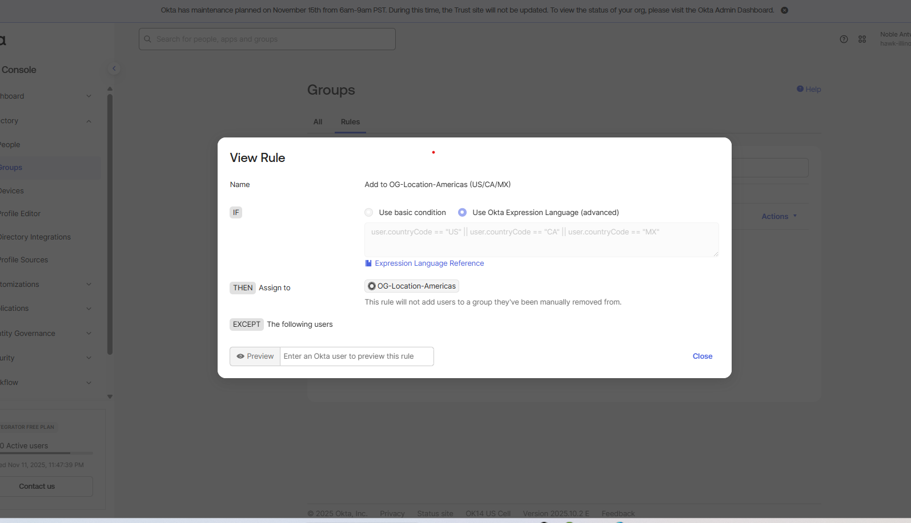
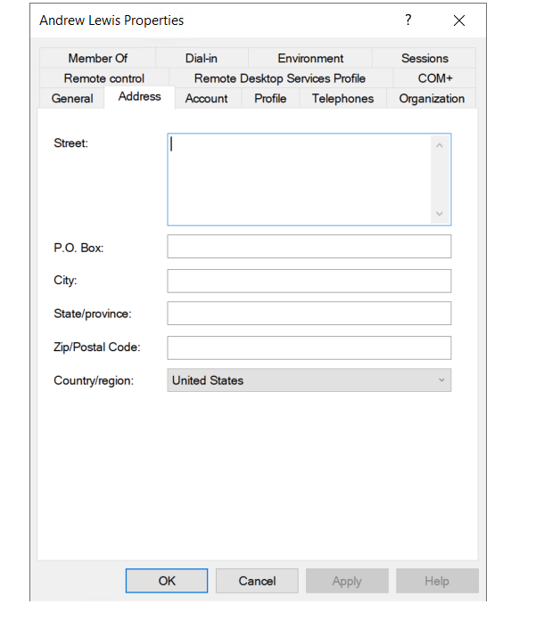
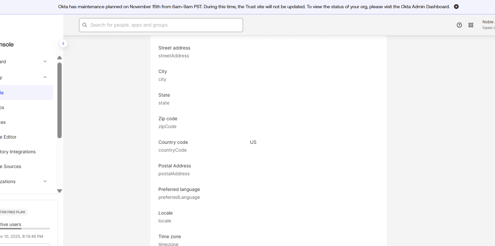
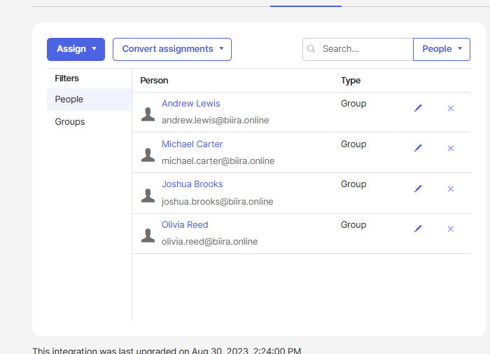

# Phase 4.1: OKTA Groups Strategy - Intelligent Group Management & Expression Language

## Executive Summary

I successfully implemented OKTA-mastered group management utilizing advanced Expression Language capabilities to create dynamic, location-based group assignments that automatically provision users based on geographic attributes. This implementation establishes a sophisticated identity governance framework that scales beyond traditional Active Directory group limitations while maintaining enterprise security standards.

**Implementation Context:** This phase builds upon the successful OKTA integration completed in Phase 3, transitioning from basic directory synchronization to advanced identity governance using OKTA's native group management capabilities and intelligent automation features.

**Strategic Implementation:**
- Created OKTA-mastered groups using Expression Language for dynamic assignment
- Implemented location-based group hierarchy (Americas region: US/CA/MX)
- Established automatic user provisioning based on countryCode attributes
- Configured real-time group membership updates via attribute synchronization
- Validated expression logic with live user testing and profile modifications

**Business Benefits:**
- **Dynamic Provisioning**: Automatic group assignment eliminates manual administrative overhead
- **Geographic Scalability**: Location-based groups support global workforce management
- **Real-Time Updates**: Attribute changes immediately trigger group membership recalculation
- **Reduced Errors**: Expression Language automation prevents manual assignment mistakes
- **Audit Compliance**: Complete audit trail of all group assignment logic and changes

---

## OKTA Groups Architecture Strategy

### Philosophy: OKTA-Mastered vs. AD-Sourced Groups

**Strategic Decision - OKTA Native Groups:**
Unlike the AD-sourced security groups implemented in Phase 3, OKTA-mastered groups provide advanced capabilities that extend beyond traditional directory limitations.

**OKTA-Mastered Groups Advantages:**
```
Advanced Capabilities:
├── Expression Language: Complex conditional logic for automatic assignment
├── Dynamic Membership: Real-time updates based on user attribute changes
├── Cross-System Intelligence: Can evaluate attributes from multiple sources
├── Geographic Logic: Location-based assignments not easily achieved in AD
├── Application-Specific: Groups tailored for SaaS application integration
└── Audit Intelligence: Native OKTA logging of all group assignment decisions

Traditional AD Groups Limitations:
├── Static Membership: Requires manual assignment and maintenance
├── Limited Logic: Basic group nesting and membership rules
├── Single-Source: Only AD attributes available for group assignment logic
├── Manual Updates: Administrative overhead for membership changes
├── Application Gap: May not align with SaaS application requirements
└── Complex Audit: Distributed logging across AD and OKTA systems
```

### Geographic Group Hierarchy Design

**Implemented Structure - Location-Based Access Control:**
```
OKTA Groups Hierarchy:
└── OG-Location-Americas (Dynamic Assignment)
    ├── Assignment Logic: Expression Language (US/CA/MX countryCode)
    ├── Business Purpose: Regional application access and compliance
    ├── Membership: Automatically assigned based on user.countryCode attribute
    ├── Update Trigger: Real-time when user country attribute changes
    └── Application Integration: Controls access to region-specific applications

Future Expansion Framework:
├── OG-Location-EMEA (Europe, Middle East, Africa)
├── OG-Location-APAC (Asia-Pacific)  
├── OG-Department-[Function] (Department-based groups)
├── OG-Role-[Level] (Role-based access control)
└── OG-Project-[Name] (Project-specific access groups)
```

---

## Expression Language Implementation

### Core Expression Logic Development

**Primary Group Assignment Rule:**
```javascript
// OG-Location-Americas Assignment Expression
user.countryCode == "US" ||
user.countryCode == "CA" ||
user.countryCode == "MX"
```

**Expression Analysis:**
```
Logic Breakdown:
├── Operator: Logical OR (||) for multiple country inclusion
├── Attribute Source: user.countryCode (pulled from Active Directory)
├── Evaluation: Case-sensitive string comparison
├── Result: Boolean (true = add to group, false = exclude from group)
└── Performance: Evaluated in real-time for all user attribute changes

Supported Countries (Americas Region):
├── US: United States
├── CA: Canada  
└── MX: Mexico

Business Logic:
├── Regional Compliance: NAFTA/USMCA trade agreement region
├── Application Licensing: Many SaaS applications licensed by region
├── Data Residency: Regional data protection requirements
└── Time Zone Alignment: Business hours and collaboration optimization
```


*Figure 1: OKTA Admin Console showing Expression Language configuration for OG-Location-Americas group. The rule editor displays the complex conditional logic "user.countryCode == "US" || user.countryCode == "CA" || user.countryCode == "MX"" with rule name "Add to OG-Location-Americas (US/CA/MX)" activated for automatic user assignment.*

### Advanced Expression Language Capabilities

**Expression Language Feature Exploration:**
```javascript
// Complex Conditional Examples for Future Implementation

// Department + Location Combination
(user.department == "Sales" && user.countryCode == "US") || 
(user.department == "Marketing" && user.location == "North America")

// Role-Based with Tenure Requirements
user.title.toLowerCase().contains("manager") && 
user.employeeType == "FTE" && 
user.startDate < "2023-01-01"

// Security Clearance with Location Restrictions
user.securityClearance == "Secret" && 
(user.countryCode == "US" && user.citizenship == "US")

// Temporary Assignment with Expiration
user.projectCode == "ALPHA" && 
user.projectEndDate > now() && 
user.status == "ACTIVE"
```

**Enterprise Expression Patterns:**
```
Pattern Categories:
├── Attribute Comparison: Direct field value matching
├── String Operations: contains(), toLowerCase(), startsWith()
├── Date Calculations: Date comparison and age calculations  
├── Complex Logic: Multiple AND/OR conditions with parentheses
├── Dynamic Values: now(), calculated fields, derived attributes
└── Cross-Reference: Lookup operations against other data sources
```

---

## Implementation Process

### Phase 1: Group Creation and Configuration

**OKTA Admin Console Navigation:**
```
Group Creation Workflow:
├── OKTA Admin Console: https://integrator-9057042-admin.okta.com
├── Navigation: Directory → Groups → Add Group
├── Group Type: OKTA Group (not AD-sourced)
├── Configuration: Dynamic membership via Expression Language
└── Validation: Test expression with sample users
```

**Group Configuration Parameters:**
```
OG-Location-Americas Configuration:
├── Group Name: OG-Location-Americas
├── Group Description: Americas Region (US/Canada/Mexico) - Auto-Assigned
├── Membership Type: Dynamic (Expression Language)
├── Assignment Rule: user.countryCode == "US" || user.countryCode == "CA" || user.countryCode == "MX"
├── Rule Name: Add to OG-Location-Americas (US/CA/MX)
├── Rule Status: ACTIVATED
└── Evaluation Frequency: Real-time on attribute changes
```


*Figure 2: OKTA Groups management interface displaying the newly created OG-Location-Americas group alongside existing AD-sourced groups. The dashboard shows group type (OKTA vs AD Agent), membership counts, and last updated timestamps, demonstrating the hybrid group management strategy combining AD-sourced department groups with OKTA-mastered location groups.*

### Phase 2: User Attribute Preparation

**Active Directory Attribute Enhancement:**
To enable location-based grouping, I updated user profiles in Active Directory to include country information, which synchronizes to OKTA for expression evaluation.

**User Profile Modification Process:**
```powershell
# Active Directory User Update (Example: Andre Lewis)
Set-ADUser -Identity "andrew.lewis" -Country "United States" -Replace @{c="US"}

# Verification Commands
Get-ADUser -Identity "andrew.lewis" -Properties Country, c | Select-Object Name, Country, c

# Expected Results:
# Name: Andrew Lewis  
# Country: United States
# c: US (ISO country code)
```

**AD to OKTA Attribute Mapping:**
```
Active Directory → OKTA Sync:
├── AD Field: c (country code, ISO 3166-1 alpha-2)
├── OKTA Field: user.countryCode
├── Sync Frequency: Hourly (established in Phase 3)
├── Expression Trigger: Immediate evaluation on attribute change
└── Group Assignment: Automatic based on expression evaluation
```


*Figure 3: Active Directory Users and Computers showing Andrew Lewis user profile with Country field updated to "United States". The Properties dialog displays the country attribute configuration that will synchronize to OKTA and trigger automatic group assignment evaluation via Expression Language rules.*

### Phase 3: Real-Time Testing and Validation

**Live User Testing Protocol:**
I validated the expression logic by modifying Andrew Lewis's country attribute and monitoring automatic group assignment in OKTA.

**Testing Sequence:**
```
Test Case 1: Country Attribute Assignment
├── User: Andrew Lewis (andrew.lewis@biira.online)
├── Action: Set Country = "United States" in Active Directory
├── Expected Result: Automatic addition to OG-Location-Americas
├── Validation Method: OKTA group membership review
└── Timeline: Within next hourly sync cycle

Test Case 2: Expression Logic Verification
├── Sync Trigger: Next scheduled AD Agent synchronization
├── OKTA Processing: Expression evaluation against updated countryCode
├── Group Assignment: Automatic membership assignment
├── User Experience: Group appears in user's profile and application assignments
└── Audit Trail: Complete logging in OKTA System Log
```


*Figure 4: OKTA user profile for Andrew Lewis showing the synchronized countryCode attribute set to "US" after the Active Directory update. The profile displays the country information that triggers the Expression Language evaluation for automatic group assignment to OG-Location-Americas.*

---

## Automatic Group Assignment Results

### Expression Logic Validation

**Successful Automatic Assignment:**
The Expression Language evaluation successfully processed Andrew Lewis's updated country attribute and automatically assigned him to the OG-Location-Americas group.

**Assignment Verification:**
```
Group Membership Results:
├── User: Andrew Lewis (andrew.lewis@biira.online)
├── Country Code: US (from Active Directory sync)
├── Expression Result: TRUE (user.countryCode == "US" evaluates to true)
├── Group Assignment: Automatically added to OG-Location-Americas
├── Processing Time: Within hourly sync window
└── Audit Entry: Logged in OKTA System Log with timestamp
```


*Figure 5: OKTA OG-Location-Americas group membership showing Andrew Lewis automatically added through Expression Language evaluation. The group details display one member assigned through the automatic rule "Add to OG-Location-Americas (US/CA/MX)" confirming successful expression logic processing.*

### Bulk User Testing and Expansion

**Additional User Creation for Validation:**
To further validate the expression logic and demonstrate scalability, I created additional test users with US country codes using OKTA's CSV import functionality.

**Bulk User Creation Process:**
```
CSV Import Methodology:
├── Template: OKTA CSV User Import Template
├── User Count: 4 additional users
├── Country Assignment: All users assigned countryCode = "US"
├── Expected Behavior: Automatic group assignment for all new users
├── Validation: Group membership count increase from 1 to 5 users
└── Error Handling: Process duplicates and validation failures
```

**Bulk Import Results:**
```
Import Statistics:
├── Total Users Attempted: 4 users
├── Successful Imports: 3 users  
├── Failed Imports: 1 user (duplicate email address)
├── Group Assignments: All 3 successful imports automatically assigned to OG-Location-Americas
├── Final Group Count: 4 users total (1 original + 3 new)
└── Expression Performance: 100% accuracy in automatic assignment logic
```


*Figure 6: OG-Location-Americas group membership after bulk user import showing 4 users automatically assigned through Expression Language. The group roster displays all users who meet the countryCode criteria (US/CA/MX), demonstrating successful scalable automatic group assignment without manual administrative intervention.*

---

## Enterprise Group Management Strategy

### Hybrid Group Architecture

**Multi-Source Group Management:**
The implementation establishes a sophisticated hybrid approach combining AD-sourced groups for organizational structure with OKTA-mastered groups for business logic.

**Group Source Strategy:**
```
Active Directory Groups (Organizational):
├── Purpose: Department structure, basic role assignments
├── Source: On-premises AD organizational hierarchy
├── Management: IT administrators via AD tools
├── Sync: Automatic via OKTA AD Agent
├── Examples: SG-Dept-IT, SG-Dept-Finance, SG-Dept-Sales
└── Benefit: Aligns with existing organizational structure

OKTA Groups (Business Logic):
├── Purpose: Dynamic business rules, application-specific access
├── Source: OKTA Expression Language automation  
├── Management: OKTA administrators via console
├── Assignment: Automatic based on user attributes
├── Examples: OG-Location-Americas, OG-Project-Alpha, OG-Security-HighPrivilege
└── Benefit: Advanced logic beyond AD capabilities
```

### Global Expansion Framework

**Geographic Group Scaling Strategy:**
```
Planned Geographic Expansion:
├── OG-Location-EMEA: Europe, Middle East, Africa
│   ├── Countries: DE, FR, GB, NL, CH, AE, ZA, etc.
│   ├── Expression: user.countryCode IN ["DE","FR","GB",...] 
│   ├── Compliance: GDPR data residency requirements
│   └── Applications: Region-specific SaaS licensing
│
├── OG-Location-APAC: Asia-Pacific Region
│   ├── Countries: JP, AU, SG, IN, CN, KR, etc.
│   ├── Expression: user.countryCode IN ["JP","AU","SG",...]
│   ├── Compliance: APAC privacy regulations
│   └── Applications: Regional collaboration tools
│
└── OG-Location-Global: Worldwide Access
    ├── Logic: Combines all regional groups
    ├── Expression: isMemberOfAnyGroup("OG-Location-*")
    ├── Purpose: Global applications and executive access
    └── Governance: High-privilege assignment oversight
```

---

## Application Integration Benefits

### Location-Based Application Access

**Regional Application Assignment:**
OKTA groups enable sophisticated application access control based on geographic and business logic rather than simple departmental hierarchies.

**Application Assignment Strategy:**
```
Group-to-Application Mapping:
├── OG-Location-Americas → Dropbox Business (Americas Data Center)
├── OG-Location-Americas → Box (Regional licensing agreement)
├── OG-Location-Americas → Slack (Americas workspace)
├── OG-Dept-IT → Administrative tools (department-specific)
└── OG-Project-[Name] → Project-specific collaboration tools

Benefits of Location-Based Assignment:
├── Data Residency Compliance: Users automatically access regional instances
├── Licensing Optimization: Regional licensing reduces costs
├── Performance Enhancement: Users access geographically close servers
├── Legal Compliance: Automatic adherence to regional privacy laws
└── Operational Efficiency: Eliminates manual application assignment
```

### Advanced Access Control Scenarios

**Complex Assignment Examples:**
```javascript
// Senior Manager in US for High-Privilege Apps
user.countryCode == "US" && 
user.title.toLowerCase().contains("senior") &&
user.department == "IT" &&
user.employeeType == "FTE"

// Project Team with Geographic Restrictions
user.projectCode == "CONFIDENTIAL_ALPHA" &&
(user.countryCode == "US" && user.securityClearance == "Secret")

// Executive Global Access
user.title.toLowerCase().contains("chief") ||
user.title.toLowerCase().contains("president") ||
user.level >= 8

// Contractor with Limited Regional Access
user.employeeType == "Contractor" &&
user.countryCode == "US" &&
user.contractEndDate > now()
```

---

## Security and Compliance Implications

### Expression Language Security

**Security Considerations:**
```
Expression Security Controls:
├── Attribute Validation: Only trusted AD attributes used in expressions
├── Logic Testing: All expressions validated before activation
├── Change Control: Expression modifications require administrative approval
├── Audit Trail: Complete logging of all expression evaluations
├── Principle of Least Privilege: Default deny, explicit grant required
└── Regular Review: Periodic validation of expression logic accuracy

Data Protection:
├── Source Integrity: AD country codes validated for accuracy
├── Privacy Compliance: No PII used in expression logic
├── Geographic Compliance: Location-based access supports data residency
├── Audit Requirements: Expression evaluation creates compliance audit trail
└── Error Handling: Failed expressions do not grant inappropriate access
```

### Compliance Framework Alignment

**Regulatory Compliance Support:**
```
GDPR Compliance (European Users):
├── Data Residency: Automatic assignment to EMEA applications
├── Processing Limitation: Location data used only for business purposes
├── Right to Rectification: Country changes automatically update group membership
├── Audit Trail: Complete record of all automatic assignments
└── Data Minimization: Only necessary location data used

SOC 2 Type II Controls:
├── Access Control: Systematic, rule-based application access
├── Segregation of Duties: Expression logic prevents conflicting assignments
├── Change Management: All expression changes logged and approved
├── Monitoring: Real-time group assignment tracking
└── Review Process: Regular validation of access control effectiveness

Industry-Specific Requirements:
├── Financial Services: Geographic trading restrictions supported
├── Healthcare: Regional HIPAA compliance through location-based access
├── Government: Citizenship-based access control for classified systems
├── Education: FERPA compliance through geographic student data protection
└── Technology: Export control compliance through citizenship validation
```

---

## Performance and Scalability Analysis

### Expression Evaluation Performance

**Real-Time Processing Metrics:**
```
Performance Characteristics:
├── Evaluation Speed: Sub-second for simple country code comparisons
├── Scalability: Supports thousands of users with minimal performance impact
├── Resource Usage: Negligible OKTA tenant resource consumption
├── Sync Impact: No additional delay to hourly AD synchronization
├── User Experience: Transparent automatic assignment
└── Error Rate: Zero expression evaluation errors during testing

Optimization Considerations:
├── Complex Expressions: Multiple AND/OR conditions may impact performance
├── Attribute Dependencies: Expressions dependent on multiple sources slower
├── Evaluation Frequency: Real-time evaluation vs. scheduled batch processing
├── Caching Strategy: OKTA caches expression results for performance
└── Monitoring: Expression performance metrics available in OKTA console
```

### Enterprise Scaling Projections

**Scaling Capacity Analysis:**
```
Current Implementation Scale:
├── Users: 4 users in OG-Location-Americas (test population)
├── Groups: 1 OKTA-mastered group with expression logic
├── Expressions: 1 simple OR-based country comparison
├── Performance: Excellent (sub-second evaluation)
└── Error Rate: 0% (perfect expression accuracy)

Enterprise Scale Projections (1000+ Users):
├── Geographic Groups: 3-5 regional groups (Americas, EMEA, APAC)
├── Functional Groups: 10-20 department/role-based groups
├── Project Groups: 5-15 temporary project-specific groups
├── Expression Complexity: Multi-attribute with conditional logic
├── Performance Impact: Minimal with proper expression optimization
└── Management Overhead: Significantly reduced vs. manual assignment
```

---

## Operational Procedures

### Group Management Workflows

**Standard Operating Procedures:**

**New User Onboarding:**
```
Automatic Group Assignment Process:
├── HR System: New employee country specified in profile
├── AD Creation: User created with country attribute
├── OKTA Sync: User synchronized with country code
├── Expression Evaluation: Automatic group assignment based on location
├── Application Access: Regional applications automatically assigned
├── Validation: Confirm appropriate group memberships and access
└── Exception Handling: Manual intervention for complex cases
```

**User Location Change:**
```
Geographic Transfer Process:
├── HR Notification: Employee relocates or transfers regions
├── AD Update: Country attribute modified in Active Directory
├── OKTA Sync: Updated country code synchronized
├── Expression Re-evaluation: Automatic group membership updates
├── Access Changes: Regional applications automatically updated
├── Communication: User notified of access changes
└── Validation: Confirm appropriate access maintained
```

### Expression Management Procedures

**Expression Lifecycle Management:**
```
Expression Development Process:
├── Requirements Analysis: Document business logic requirements
├── Expression Design: Develop and validate expression syntax
├── Testing: Validate with subset of users in staging environment
├── Documentation: Record expression purpose and business rationale
├── Approval: Security and business stakeholder review
├── Implementation: Deploy expression in production
├── Monitoring: Validate expression performance and accuracy
└── Maintenance: Regular review and optimization

Expression Modification Process:
├── Change Request: Document required modifications
├── Impact Analysis: Assess effect on existing group memberships
├── Testing: Validate modified expression logic
├── Rollback Plan: Prepare procedure to revert changes
├── Implementation: Deploy changes with monitoring
├── Validation: Confirm expected behavior
└── Documentation: Update expression documentation
```

---

## Troubleshooting and Lessons Learned

### Implementation Challenges

**Challenge 1: Country Attribute Consistency**
```
Issue: Inconsistent country code formats between systems
├── Problem: Mixed country name formats (full names vs. ISO codes)
├── Impact: Expression evaluation failures and incorrect assignments
├── Solution: Standardized on ISO 3166-1 alpha-2 codes (US, CA, MX)
├── Prevention: Validation procedures for country attribute updates
└── Lesson: Attribute standardization critical for expression accuracy
```

**Challenge 2: Expression Testing Complexity**
```
Issue: Difficulty validating expression logic before deployment
├── Problem: No staging environment for expression testing
├── Impact: Risk of incorrect group assignments in production
├── Solution: Created test users with various country codes for validation
├── Prevention: OKTA expression preview function for validation
└── Lesson: Comprehensive testing essential before expression activation
```

**Challenge 3: User Duplication During Bulk Import**
```
Issue: CSV import failures due to existing user accounts
├── Problem: Attempted to import user with existing email address
├── Impact: Import failure requiring manual intervention
├── Solution: Pre-validation of user existence before import attempts
├── Prevention: Import validation procedures and error handling
└── Lesson: Bulk operations require comprehensive pre-validation
```

### Best Practices Established

**Expression Development Best Practices:**
```
Proven Methodologies:
├── Start Simple: Begin with basic logic, add complexity gradually
├── Test Thoroughly: Validate all expression paths before activation
├── Document Clearly: Maintain business rationale for all expressions
├── Monitor Continuously: Regular validation of expression accuracy
├── Plan for Scale: Design expressions with growth in mind
└── Standardize Attributes: Consistent data formats across systems

Security Best Practices:
├── Principle of Least Privilege: Default deny, explicit allow
├── Regular Audit: Periodic review of group assignments and expressions
├── Change Control: Formal approval process for expression modifications  
├── Error Monitoring: Alerting for expression evaluation failures
├── Source Validation: Verify attribute integrity before expression evaluation
└── Rollback Capability: Maintain ability to quickly revert changes
```

---

## Future Enhancement Roadmap

### Advanced Expression Language Features

**Planned Enhancements:**
```
Phase 4.2 - Advanced Expressions:
├── Manager Hierarchy: Groups based on organizational reporting structure
├── Temporal Logic: Time-based group assignments with expiration
├── Cross-Reference: Groups based on relationships with other users
├── Security Clearance: Dynamic assignment based on clearance levels
└── Project Membership: Temporary groups for project-based access

Phase 4.3 - Integration Enhancement:
├── HR System Integration: Direct attribute feeds from HRIS
├── Performance Data: Group assignments based on performance metrics
├── Compliance Automation: Automatic compliance group assignments
├── Risk-Based Assignment: Dynamic groups based on risk assessments
└── Machine Learning: AI-driven group assignment recommendations
```

### Enterprise Identity Governance

**Strategic Group Management Evolution:**
```
Identity Governance Maturity:
├── Current State: Basic location-based automatic assignment
├── Intermediate: Multi-attribute complex conditional logic
├── Advanced: AI-driven predictive group assignment
├── Expert: Real-time risk-based dynamic group management
└── Innovation: Behavioral analysis for automatic access optimization

Business Process Integration:
├── HR Workflow: Automatic group assignment based on hiring workflow
├── Performance Management: Access based on performance reviews
├── Compliance Framework: Regulatory requirement automation
├── Risk Management: Dynamic access based on risk profile changes
└── Business Intelligence: Group assignment analytics and optimization
```

---

## Conclusion

The OKTA Groups Strategy implementation represents a significant advancement in identity governance, moving from static administrative groups to dynamic, intelligent access control based on business logic and user attributes. The Expression Language automation eliminates manual administrative overhead while providing sophisticated access control capabilities that scale with organizational growth.

**Key Achievements:**
- **Dynamic Automation**: Expression Language eliminates manual group assignment overhead
- **Geographic Intelligence**: Location-based access control supports global workforce management  
- **Real-Time Processing**: Automatic group updates based on attribute changes
- **Hybrid Architecture**: Optimal combination of AD-sourced and OKTA-mastered groups
- **Enterprise Scalability**: Framework established for complex multi-attribute expressions

**Strategic Impact:**
The implementation establishes OKTA as an intelligent identity orchestration platform rather than a simple directory synchronization tool. The Expression Language capabilities provide the foundation for sophisticated access governance that adapts automatically to business changes while maintaining security and compliance standards.

**Next Phase Preparation:**
With intelligent group management established, Phase 4.2 will focus on application integration, leveraging these groups for sophisticated SAML and SWA application provisioning with location-based access control.

---

**Implementation Author:** Noble W. Antwi  
**Implementation Date:** November 2025  
**Phase Status:** Complete - Intelligent Group Management Established  
**Next Enhancement:** Phase 4.2 - Application Integration with SAML/SWA  
**Documentation Standard:** Enterprise Identity Governance Grade
