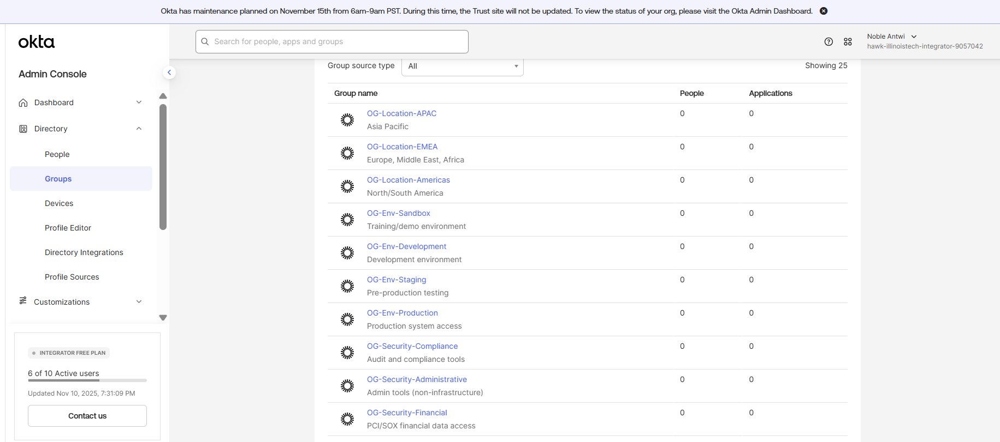

# OKTA OIN EXPLORATION

SETTING UP GROUPS IN OKTA(OKTA MASTERED GROUPS)

GROUPS CREATED



I updated ANdre Lewis Country/Region to United States  and then did an import again


Image Showing Andre Lewis having country Attribute Set to United States

This update was reflected in OKTA and then his ContrryCode attribute got upated to US as shown below


The final Rule Rule i used was 

```bash
user.countryCode == "US" ||
user.countryCode == "CA" ||
user.countryCode == "MX"
```

This was done in the OKTA Expression Language. 

The rule was named “Add to OG-Location-Americas (US/CA/MX)” adn then activated. 

This group as of now has added one user automatically to it… as depicted below.


I proceeded to add users to the OKTA (4users) with each of them having their country code set to US.Ther users were created using the OKTA CSV import template

Addition of these users automatically increased the number of users in the  OG-Location-Americas group to 4, since there was an error in the creation of one of the users, but that will be resolved later.

Actuall,y the user filed because it already exists in the OKTA tenant with the same set of information.

NOW in the next step, I will proceed with Application Integration by adding two applications, one using SAML and the other using SWA

The first app integration will be Dropbox for Business, which also supports SAML and SWA.

With Dropbox for business, I will make use of SAML protocol,

in the App Catalog, I selected the Dropbox Busineess

INt eh General Settings, Ichanged the applicationLabel to Dropbox seen below


IN the Sing-On Option, The default of SWA was selectbut i wanted SAML 2.0 SSO which is waht i picked.

OKTA provided the setup instruction nicely

where the IDentity provider URL was  indicated to be [https://login.biira.online/app/dropbox_for_business/exkxbs0oofWEmhSN0697/sso/saml](https://login.biira.online/app/dropbox_for_business/exkxbs0oofWEmhSN0697/sso/saml) and the correwposing X.509 certificate was downloaded.


Inthe above, I signed upnfor Dropbox for Business Trail account which should last for 30days.

The default SSO setup page  also loaded in the Settings.I also enabled SSO sigen on as required ensuring users coming from OKTA…later i might change that in order to be jihgly avialable .

Rhe IDentiy provider URL was provided 


Back in OKTA, Silent Provisiong was turned on.

in CredentialDetails

The APplication UsernameFormat was set to OKTA username since it is unique and also works well with On -prem username

Passwrod Revealoption was also tuned off since we are doing a SAML integration.

I then wen on to aassign the App to members of the 

[**OG-Location-Americas](https://integrator-9057042-admin.okta.com/admin/group/00gxbp5preV7Nb81Y697) group as shown in the** below image.

---


This was automatically assigned to 4 users who are members of the group. 

In the next assignment, I will be provisionin box application.

Going through the same OIN, i searched for box as sen below


althoguh there is SMAL integration available which is a better option, I willmake use of SWA which is more of password vaulting. 


Picking SWA Optino

I selected the option for the user to set hisown usernam and password in order to lift the burden on the admins a little more

All other options are left the same and the Reveal passowrd oiption was leftand check since its SWA

Box was also assigend to Users by gorup with teh gro OG-LOcation-AMericas as the one it was asigned to.\

Now that the two apps have been assigned, it is time to test and see how it works. I willbe wokring with the User “Joshua Brooks” ( joshua.brooks@biira.online)

Upon Confirming his identity, Joshua was able to login into OKTA and was greeted with the Apps that was assinged to him and the group he belongs to as shown below


In Dropbox for business, i only have one user as in the AdminsitratorAccount Setup which is my personal Mealil address as shown below

I will document any changes to the users when Joshua logs in..maybe if nothtiung happens then we can configure the provisiong tab


When Joshua Brooks initiated the sign in process, He was then greeted witht eh Sign Sign-on portal as hsown below


THe users was not able to sign into Dropbox for business because the provisioning was not configured. TheAPI integration was done succesfully as shown below


Now in the configurationof the Provision from OKTA to App 

SOme of the optiions I Picked were

1. Create Users: 
2. Update Atrributes
3. DeaactiveUsers which dropbox will remove the user and keep his files in Dropbox for management

THeUser mappings we kept as 

| **Attribute** | **Attribute Type** | **Value** | **Apply on** |  |
| --- | --- | --- | --- | --- |
| [**Hide Unmapped Attributes**](https://integrator-9057042-admin.okta.com/admin/app/dropbox_for_business/instance/0oaxbs0oogMxSHpIb697/#) |  |  |  |  |
| Username
userName | Personal | Configured in [Sign On settings](https://integrator-9057042-admin.okta.com/admin/app/dropbox_for_business/instance/0oaxbs0oogMxSHpIb697/#tab-signon) |  |  |
| Given Name
firstName | Personal | user.firstName | Create and update |  |
| Surname
lastName | Personal | user.lastName | Create and update |  |
| Email
email | Personal | user.email | Create and update |  |

Initially there was only the Dropbox Admin in the account, with teh new Provisioning established, when we sign in for Johis and any other user that has the app assigned, that user should be created in Dropbox automatically due to the provisioning configured.

It is very important to indicate a that,anytimeyou log into any browser for the first time, The OKTApLuginwill ligh up to install, which will come in handly duringhthe the implementation of SWA especially.


Agen Plugin asking for installation

[https://www.notion.so](https://www.notion.so)

The whole Integration of Dropbox Business Hit a blockade and i have to continute to fixit and get it working with the  below information

NOW MOVING ON TO IMPLEMENTING SWA (PASSWROD VAULTING )  WITH  BOX

Earlier in   process above, we integrated the steps for SWA with BOX